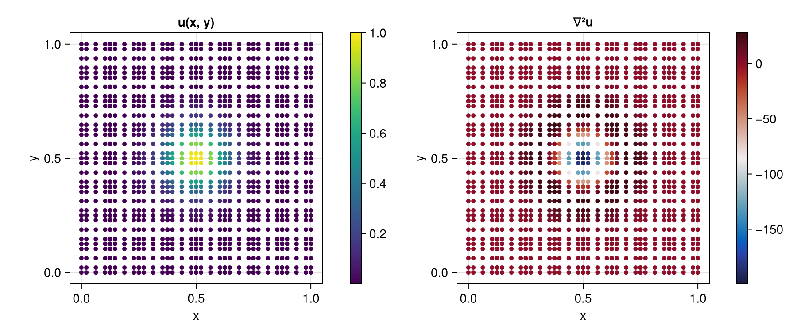

# HexSBPSAT.jl

SBP-SAT (Summation-By-Parts / Simultaneous-Approximation-Term)
spectral-element operators for arbitrary orders of accuracy on
conforming hexahedral meshes for 1, 2, and 3 dimensions.

[](https://github.com/eschnett/HexSBPSAT.jl/actions/workflows/CI.yml)
[](https://eschnett.github.io/HexSBPSAT.jl/)

## Details

This package provides spectral derivative operators for the
unstructured hexahedral (distorted cube) meshes of
[HexMeshes.jl](https://github.com/eschnetter/HexMeshes.jl). The
multi-dimensional operators are tensor products of one-dimensional
operators, transformed from a reference element to the actual element
geometry, which may be curvilinear.

HexSBPSAT provides derivative operators (gradient / divergence),
boundary operators, norms, as well as a second derivative (Laplacian)
operator. HexSBPSAT is designed to support second-order-in-space PDE
formulations.

HexSBPSAT is GPU-efficient. All its operators can be used in GPU
kernels.

## Examples

This example builds a Cartesian 2D spectral-element mesh, initializes a
Gaussian bump, applies the SBP-SAT Laplacian, and displays the field and
its Laplacian inline in a sixel-capable terminal (via
[CairoMakie](https://docs.makie.org/), `FileIO`, and `SixelTerm`):

```julia
using HexMeshes: make_uniform_quad
using HexSBPSAT
using CairoMakie, FileIO, SixelTerm   # visualization

# Build an 8×8 spectral-element Cartesian mesh on [0,1]², degree-4 elements
T = Float64
M, N = 8, 5
mesh = make_uniform_quad(T, M, M, 0.0, 1.0)
elem = make_element(T, N)
ops  = make_operators(elem)
geom = make_geometry(mesh, elem)
work = make_workspace(geom)

# Initialize a Gaussian bump centered at (0.5, 0.5)
xs = geom.coords[1, :, :, :]
ys = geom.coords[2, :, :, :]
σ  = 0.1
u  = @. exp(-((xs - 0.5)^2 + (ys - 0.5)^2) / (2σ^2))

# Apply the SBP-SAT Laplacian ∇²u (homogeneous Dirichlet boundaries).
# τ is the interior-penalty SAT strength; this value keeps the operator
# symmetric and negative-semidefinite.
lap = similar(u)
τ   = T(3//2) * (N - 1)^2
apply_laplacian!(lap, u, ntuple(_ -> zero(T), Val(4)); geom, ops, work, τ)

# Plot the field and its Laplacian side by side. The collocation nodes are
# per-element GLL points (not a regular grid), so we scatter the nodal values.
fig = Figure(size = (900, 380))
for (j, (field, label, cmap)) in enumerate(((u,   "u(x, y)", :viridis),
                                            (lap, "∇²u",     :balance)))
    ax = Axis(fig[1, 2j-1]; title = label, xlabel = "x", ylabel = "y", aspect = 1)
    pl = scatter!(ax, vec(xs), vec(ys); color = vec(field),
                  colormap = cmap, markersize = 7)
    Colorbar(fig[1, 2j], pl)
end

# Render inline in a sixel-capable terminal (also writes a PNG)
display(fig)
save("laplacian.png", fig)
```


